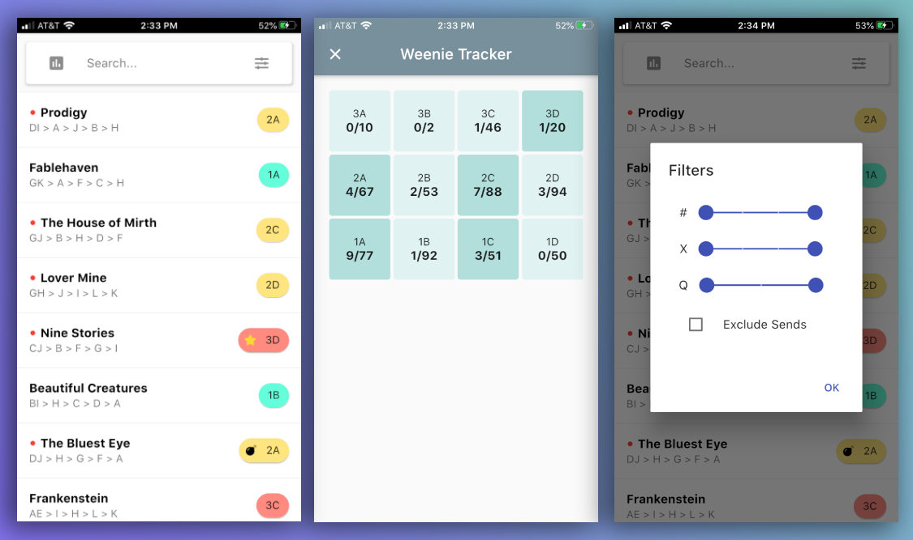
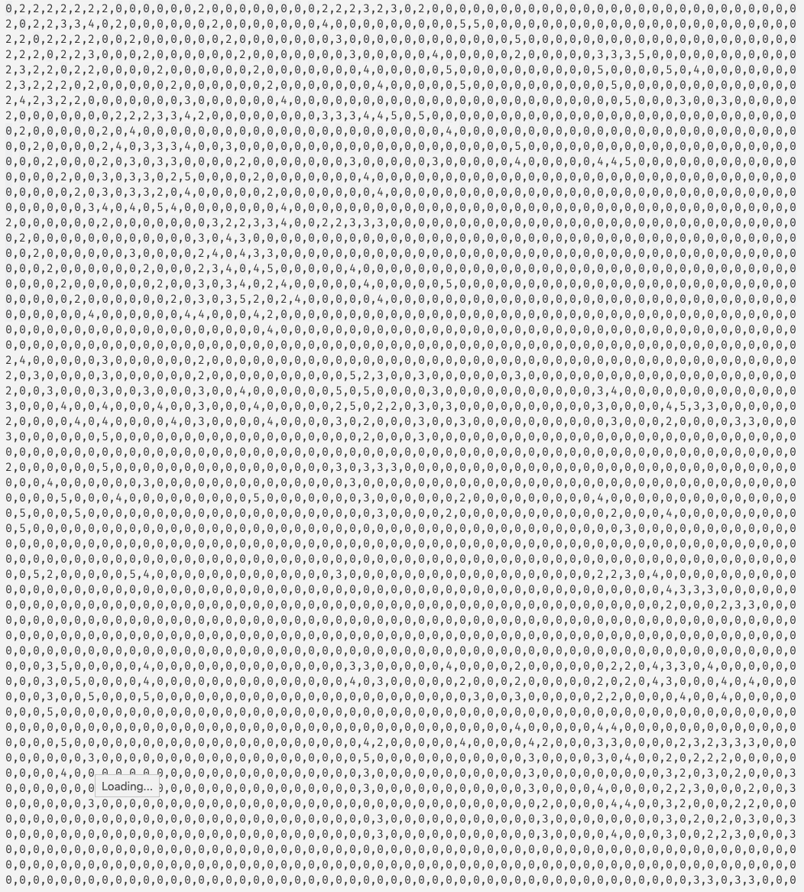
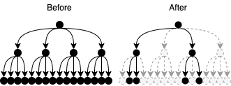

# Doomboard


## Purpose
Helth

## Overview
I screwed bits of wood to the bottom of my deck to create some form of climbing training. Next, I generated hundreds of routes and collected them into a "guidebook". Finally, I'm spending too many hours under my deck climbing these choss piles.





---

## Discovering Moves

I have twelve holds labeled A-L. I need to generate fewer than 1000 problems with each problem being reasonably possible.

### The Move Matrix

A move, considering hands only, is determined by three holds. Which holds are your hands currently on, and which holds are you going to? One of the three holds becomes a connection between the start position and the end position. If we treat the positions as vertices, then the moves are edges, ex: `AB -> BC`. There are `(12 choose 2) = 66` positions, but I do not want to include some. Some of these are unreasonable -- the holds are greater than arm's length or at [funny angles](https://www.youtube.com/watch?v=TsodSKsdRMk). I hear you; I'm soft. Of the 66, I identified 58.

### What are the moves?
I need to determine which positions are connected by a hold. This simply means checking for a shared character in two positions.

```
for i := 0; i < len(moves); i++ {
  for j := 0; j < len(moves); j++ {
    a := moves[i]
    b := moves[j]
    if  j != i && strings.ContainsAny(a, b) {
      fmt.Printf("%s -> %s", a, b)
    }
  }
}
```

I represented the moves as a weighted adjacency matrix where edge weight is the move's difficulty. I generated the adjacency matrix with row and column labels, then I [tested](https://czechpoints.com/wp-content/uploads/Adam-Ondra-e1566242383268.jpg) all 515 moves in the upper right triangle. I rated each move's difficulty on a scale from 1 to 4. Each move is, ideally, reversible. This means the matrix is symmetrical, and I can complete the matrix by reflecting the upper right triangle.

The unweighted moves can be found in [moves/moves_unweighted.txt](./moves/moves_unweighted.txt). The weighted moves can be found in [moves/moves_weighted.txt](./moves/moves_weighted.txt).

```
grep -o 1 ./moves_unweighted.txt | wc -l
1030
# -> 515 in upper triangle
```

> NOTE: The 1-4 scale is shifted to 2-5. I used 1 as a placeholder.



## Generating Problems
I began by converting the adjacency matrix to an adjacency list. Then, I generated all walks of length 4-7 i.e. problems with 4-7 moves. This was way too many, so I added some limiting conditions.

- No repeated holds (eliminates cycles)
- Problems have exactly four moves
  - You can always suggest extensions/link-ups in the spray
- After two positions, only walk two random subtrees
  - This more easily explained with a diagram



The last rule helps avoid generating a bunch of routes with long shared prefixes like so.
```
A B C D W
A B C D X
A B C D Y
A B C D Z
```

`Results: 650 problems`

## Naming Problems
I downloaded a list of popular books on Goodreads. Famous titles  make it easy to remember problems.

```
# Filter the list to shorter titles
gawk -v FPAT='[^,]*|("[^"]*")+' '{
  if (length($1) <= 20)
    print $1","$2
}' books.csv > books-short.csv
```

## Grading
The goal was to assign problems to categories. If the book titles had genres associated with them, I would have used those. The grades were generated by averaging the difficulty of each move with random +1/-1 difficulty sprinkled in. Without adding a bit of randomness to the grading, 480/650 problems all had the difficulty 2. Grade A is the average, and grade B is the quarter subdivision of that average.

### Grade B
I subdivided the "rounding interval" into four parts and assigned a letter a-d. For example, the numbers which average to 2 are in the rounding interval [1.5,2.5).

```
.50-.74 -> a
.75-.99 -> b
--- avg. ---
.00-.24 -> c
.25-.49 -> d
```

### Examples
| Avg | Grade A | Grade B |
| --- | ------- | ------- |
| 1.5 | 2       | a       |
| 2.8 | 3       | b       |
| 3.0 | 3       | c       |
| 1.4 | 1       | d       |

### Distribution
```
cat problems.json | jq -j '.[] | .grade_a," ", .grade_b, "\n"' | sort | uniq -c
  77 1 1
  92 1 2
  51 1 3
  50 1 4
  67 2 1
  53 2 2
  88 2 3
  94 2 4
  10 3 1
   2 3 2
  46 3 3
  20 3 4

# count,  grade_a, grade_b (1-4 -> a-d)
```

## 