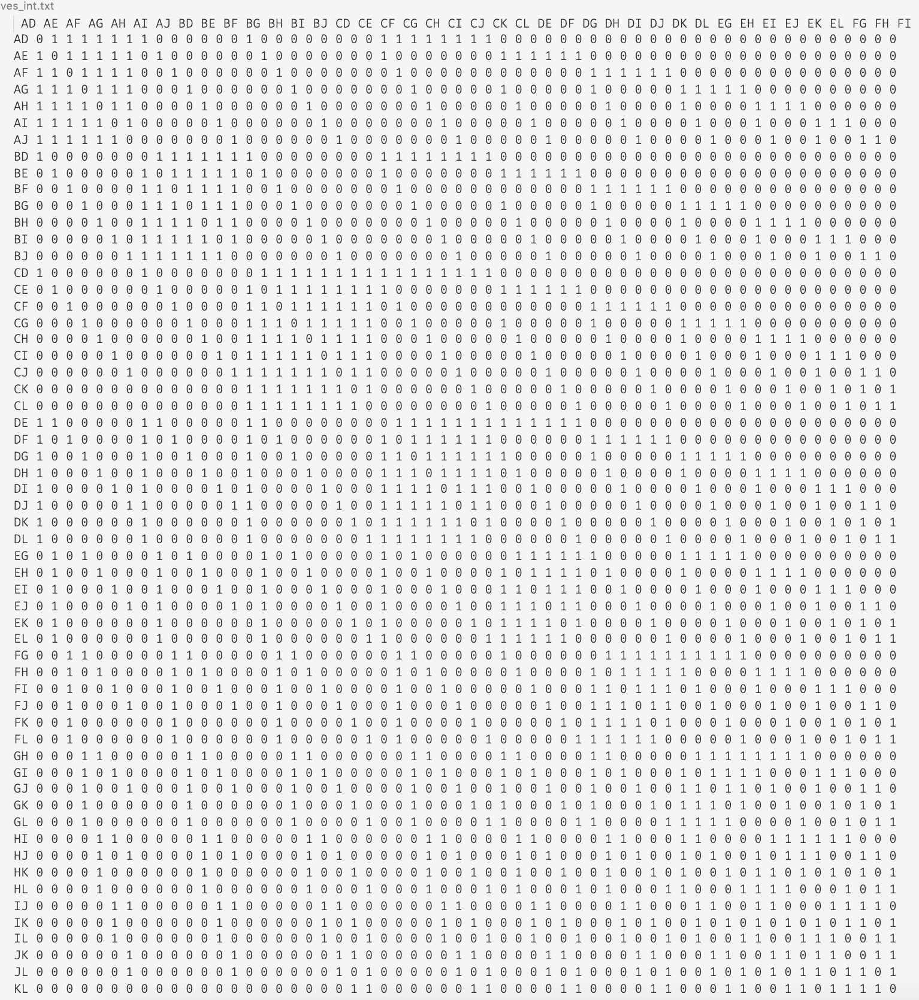
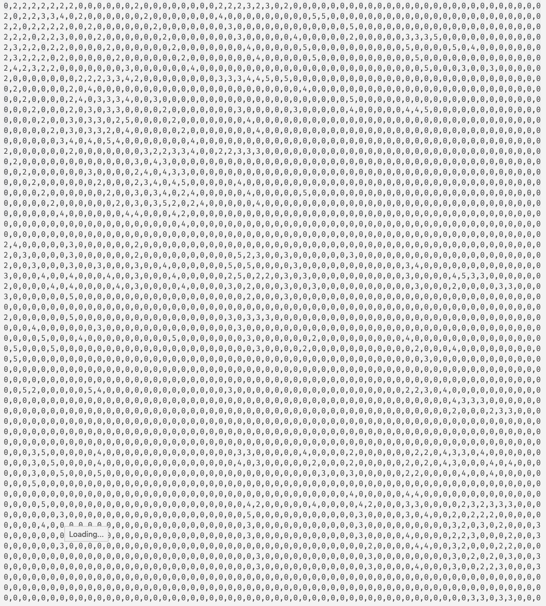

# The Move Matrix

A move, considering hands only, is determined by three holds. Which holds are your hands currently on, and which holds are you going to? One of the three holds becomes a connection between the start position and the end position. If we treat the positions as vertices, then the moves are edges, ex: `AB -> BC`.

## What are the positions?
There are `(12 choose 2) = 66` positions, but I do not want to include some. Some of these are unreasonable -- the holds are greater than arm's length or at [funny angles](https://www.youtube.com/watch?v=TsodSKsdRMk). I hear you; I'm soft. Of the 66, I identified 58. This didn't exactly narrow down the possibilities.

## What are the moves?
I need to determine which positions are connected by a hold. This simply means checking for a shared character in two positions.

```
for i := 0; i < len(moves); i++ {
  for j := 0; j < len(moves); j++ {
    a := moves[i]
    b := moves[j]
    if  j != i && strings.ContainsAny(a, b) {
      fmt.Printf("%s -> %s", a, b)
    }
  }
}
```

This prints the edges, but there is a better way to organize this. I will represent the moves as an adjacency matrix where the edge weight is the difficulty of the move. Each move is reversible, ideally, which means the edges have no direction and therefore the matrix is symmetrical. This means that I will only have to test the moves in the upper right triangle of the matrix, and then I can just reflect over the diagonal. I've adjusted the code to print the 0-1 adjacency matrix with row and column labels. I then ~[manually](https://czechpoints.com/wp-content/uploads/Adam-Ondra-e1566242383268.jpg)~ tested all 515 moves in the upper right triangle.

Here's what the matrix looks like. Note that the fields are space-delimited so the one-char column values don't visually align with the two-char headers. Luckily computers don't care about visual alignment. You can see the symmetry in this low-quality ascii art.

```
grep -o 1 ./moves_unweighted.txt | wc -l
1030
# -> 515 in upper triangle
```



## How difficult are the moves?
After a lot of subjective measurement of whack campusing, I settled upon a nearly meaningless rating system. A move's difficulty is rated on a scale of 1-4: easy, medium, hard, limit. Most of the easy and medium moves are fun; the hard moves were heinous; the limit moves are a mix of extra-heinous and fun.

Here is the weighted adjacency matrix after reflection. It was made by importing the space-delimited unweighted matrix into excel, color-coding difficulties, then exporting to csv which was translated and reflected.



### Weighted Moves to JSON
This is simply converting an adjacency matrix to an adjacency list. The moves in the adjacency matrix have the weights
- 0: not a move
- 1: to be determined
- 2-5: easy, medium, hard, limit

I've only included moves with a weight greater than one in the adjacency matrix, and converted them to the 1-4 difficulty scale`.

### Moves to Problems

Generate all walks of length 4-7 i.e. problems with 4-7 moves.

Psych! There are way too many.

#### Revision 1
- No repeated moves (eliminates cycles)
- Problems have exactly five moves
  - You can always suggest extensions in the spray

`Results: 2.3m problems`

#### Revision 2
- No repeated holds
- Problems have exactly four moves

`Results: 6k problems`

#### Revision 3
6k is a decent improvement from 8.9 trillion, but it is a lot more than I'd like. I would prefer to avoid many repeated problems like the following. Each letter represents a position.

```
A B C D W
A B C D X
A B C D Y
A B C D Z
```

These problems are quite similar. I do not want to keep all of them. How will I choose which subtree to generate from? Answer: randomness -- because they're all choss anyways. If the route has more than one move (two positions), then choose only two more positions at random.

`Results: 650 problems`

## Creating Problems from Sets of Moves
I've generated 650 problems. Now I need to attach grades and give each route a name.

### Naming

I downloaded a list of the popular books from Goodreads. Famous titles will make it easy to remember problems.

```
# Filter the list to shorter titles
gawk -v FPAT='[^,]*|("[^"]*")+' '{
  if (length($1) <= 20)
    print $1","$2
}' books.csv > books-short.csv
```


